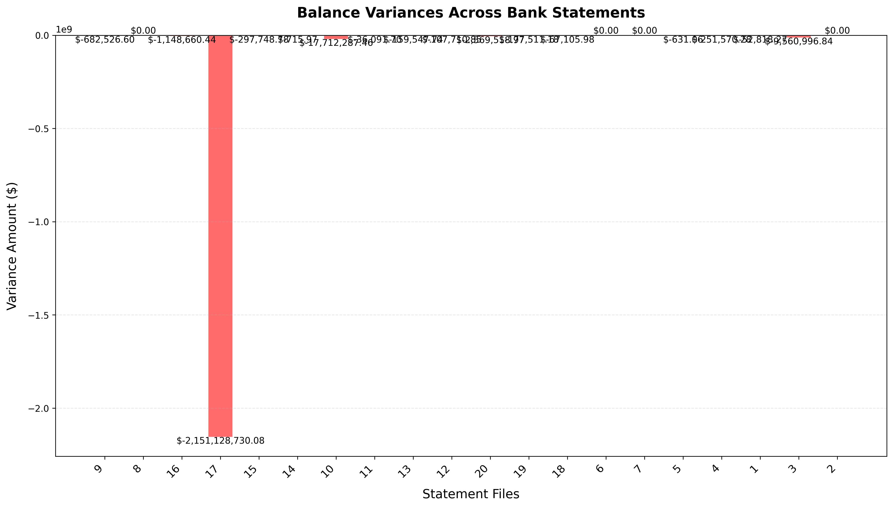

# Bank Statement Analysis Tool

This Python script analyzes bank statements in PDF format using Azure Form Recognizer to extract and validate financial data.

## Features

- Extracts starting and ending balances from bank statements
- Identifies and processes transactions
- Validates balance calculations and identifies discrepancies 
- Generates CSV reports with extracted data
- Creates discrepancy reports for auditing
- Provides variance analysis visualization

## Prerequisites

- Python 3.7+
- Azure Form Recognizer service
- Required Python packages:
  - azure-ai-formrecognizer
  - pandas
  - matplotlib

## Variance Analysis Graph

Below is a visualization of balance variances across analyzed bank statements:

